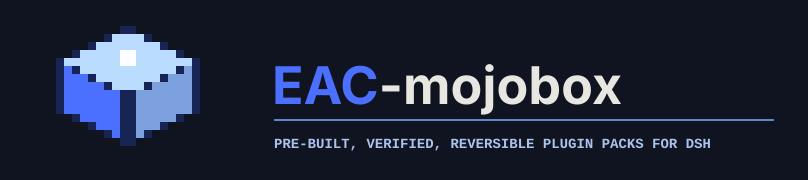

<h1 align="center">
  
</h1>

<p align="center">为 DSH 生态收纳插件、功能整合包与皮肤资料，连接内容作者和下游市场。</p>

<p align="center">
  <a href="https://dsh-eac.github.io/EAC-mojobox/">浏览目录</a> ·
  <a href="#提交资源">提交资源</a> ·
  <a href="#下游接入">下游接入</a> ·
  <a href="#开发与验证">参与开发</a> ·
  <a href="docs/README.md">文档索引</a>
</p>

Mojobox 把散落在 npm、GitHub 和作者仓库里的资源整理成有版本、有来源、有说明的目录，
核对归档结构和文件摘要，展示使用边界，并提供作者原始文件下载。

**上游维护内容，Mojobox 收纳与供给，下游负责安装和运行。**
静态检验通过表示文件和记录符合收录要求，不表示插件安全、无冲突或已经在你的宿主上测试。

## 从这里开始

| 你想做什么 | 最短路径 |
| --- | --- |
| 找插件或整合包 | [浏览网站](https://dsh-eac.github.io/EAC-mojobox/)，看用途、来源、检查范围和原始下载 |
| 提交自己的资源 | [选提交类型](#提交资源) → 准备材料 → Fork + PR → CI 与维护者审核 |
| 推荐资源或不确定格式 | [提交来源咨询](https://github.com/DSH-EAC/EAC-mojobox/issues/new?template=package-submission.yml)，无需先制作完整 PR |
| 为市场或加载器取资源 | [下游接入](#下游接入)，读取静态索引并核验原始字节 |
| 了解项目或贡献代码 | [职责与进度](#项目边界与进度)、[开发与验证](#开发与验证)、[贡献指南](CONTRIBUTING.md) |

## 收纳什么

| 资源 | 它是什么 | 当前规模 | 收录后提供什么 |
| --- | --- | --- | --- |
| 独立插件 | 作者发布的一个软件包；信息卡只描述它，不改变运行时格式 | 26 条：24 个原始下载、2 个仅来源 | 精确版本、兼容/冲突/限制、来源；有许可与合格归档时提供下载 |
| 功能整合包 | 一组插件引用组成的薄 Feature Pack；`.dshpack` 中以根 `pack.json` 声明组合 | 14 个 | 组合说明、原始归档、清单与静态检验报告 |
| 皮肤/外观归档 | `appearance` 类薄 Feature Pack，额外描述皮肤和 loader 信息 | 8 个 | 来源、组件、loader 声明、预览与原始归档 |
| 皮肤 Prompt 资料 | 用于设计和复刻的 `manifest.json`、`prompt.md`、`README.md` | 10 套 | 固定来源、资料文件、许可与预览；不可直接安装 |
| Skill | 预留分类 | 暂不收录 | 当前没有独立 Skill 协议、下载或安装入口 |

数量为当前仓库快照，网站以实际部署版本为准。插件附带的 Skill 保留在作者发行里，不拆成独立资源。
整合包的来源、选型和作者清单见 [authoring/](authoring/README.md)；历史检查结果见[验收记录](docs/plugin-catalog-acceptance-20261010.md)。

## 提交资源

先按交付物选择类型，不需要阅读所有协议。**正式收录通过 GitHub PR；Issue 是候选和咨询入口。**
网页[提交指南](https://dsh-eac.github.io/EAC-mojobox/#/contribute)提供相同分类；新页面随本次改版部署后可用。

### 1. 选类型，找到对应材料

| 类型与提交方案 | 必须交什么 | 放在哪里 | 格式与例子 |
| --- | --- | --- | --- |
| [独立插件](docs/community-submissions.md#plugin) | 一张轻量 JSON 信息卡；原始 npm `.tgz` 可选 | `catalog/plugin-listings/<id>.json`；下载放 `artifacts/plugins/<id>-<version>.tgz` | [最小信息卡](docs/plugin-intake.md#最少提交什么)、[Schema](schemas/plugin-listing.schema.json) |
| [功能整合包](docs/community-submissions.md#pack) | 薄 `.dshpack` + 同 ID 收录 JSON | `artifacts/<id>-<version>.dshpack`、`catalog/feature-packs/<id>.json` | [文件组成与最小清单](docs/author-pack-request.md)、[收录规范](docs/intake.md) |
| [皮肤/外观归档](docs/community-submissions.md#skin) | 同上；分类 `appearance`，增加外观声明 | 同功能包；可选截图放 `catalog/previews/<id>/` | [皮肤提交规则](docs/community-submissions.md#skin)、[Schema](schemas/intake.schema.json) |
| [皮肤 Prompt 资料](docs/community-submissions.md#prompt) | 三个资料文件 + 固定 commit、路径和文件摘要记录 | `catalog/skin-prompt-packages/<id>/`；在 `source.json` 追加条目 | [资料提交示例](docs/community-submissions.md#prompt)、[Schema](schemas/skin-prompt-package.schema.json) |

完整客户端、Profile、带内嵌代码的整套环境和其他格式先开 Issue 讨论，不转成薄包冒充已支持。
许可不明确或下载超限的独立插件可以先收来源；新的整合包不能编造必填的宿主范围，应先作为候选讨论。

### 2. 遵守共同规则

- **身份与来源可追溯**：稳定 ID、精确版本、正式 HTTPS 来源；作者提交与目录代录分别标明。
- **许可单独核对**：代码、图片、音频和截图各自说明；Mojobox 的 MIT 许可不覆盖上游资源。
- **未知就写未知**：兼容、冲突和运行结果不能猜。新薄包须声明合法 `requires.dsh`，外部组件须精确版本；详见[版本策略](docs/intake-version-policy.md)。
- **保留原始字节**：不重打包作者插件，不修改、删除或重命名旧归档；更新软件提交新版本、新文件和新摘要。Prompt 内容更新须更新来源 commit 与摘要。
- **只投递公开材料**：不提交凭据、聊天、Profile、私人路径或构建目录。标签、介绍和预览要求见[展示规范](docs/community-submissions.md#3-预览图由作者提供)。

### 3. 完成一次投递

1. Fork 本仓库，从最新 `main` 建立 `feat/add-<id>` 或 `fix/update-<id>` 分支。
2. 按类型添加事实源和材料，运行下方的[验证命令](#开发与验证)，不要修改上游协议来绕过收录要求。
3. 提交并推送到自己的 Fork，向本仓库 `main` 发起 PR，填写[模板](.github/PULL_REQUEST_TEMPLATE.md)：目的、来源、许可、限制、真实测试范围和验证结果。
4. 等待 `check` 与维护者审核。CI 检查结构和字节；维护者核对归属、再分发许可与内容边界。
5. 合并后由 Pages 工作流再次检查并发布。网站成功发布后下游才能取得更新；合并不等于已上线。

完整操作见[作者提交与审核](docs/community-submissions.md#submit)。更新、撤回和故障处理也遵循该指南。

## 下游接入

Mojobox 的插件接口是**静态 JSON 来源索引**，不需要登录或后端端口。下游实现一次读取与映射，
即可按需刷新目录；无需解析网页，也无需每次收录都向 Mojobox 反馈。

### 插件市场：读取来源索引

当前站点根为 `https://dsh-eac.github.io/EAC-mojobox/`，插件入口：

```text
https://dsh-eac.github.io/EAC-mojobox/generated/api/v1/plugins.json
```

索引格式为 `plugins.mojobox.dev/v1`，同目录提供
[索引 Schema](https://dsh-eac.github.io/EAC-mojobox/generated/api/v1/schemas/plugin-index.schema.json)
和 [信息卡 Schema](https://dsh-eac.github.io/EAC-mojobox/generated/api/v1/schemas/plugin-listing.schema.json)。
取到索引后，下游按以下顺序处理：

1. 限长读取、校验 Schema 和身份，拒绝生产源里的 `demo: true`；保留完整兼容、冲突和限制。
2. `download: null` 只展示来源。有下载时，使用 `new URL(download.url, indexUrl)` 解析地址，并核对实际大小和 SHA-256；报告同样核对。
3. 用完整合法快照更新市场。请求或校验失败保留上次成功目录，索引移除条目不触发自动卸载。
4. 安装资格、依赖、权限、平台和真实运行由下游宿主判断；索引不授予安装许可。

字段、正反例、更新语义和本地联调见[插件来源接口 v1](docs/plugin-source-api-v1.md)。`revision` 是内容指纹，
不是发布序号或签名；当前静态站不保证旧版本下载 URL 永久存在。

### 整合包与皮肤工具：按契约选择入口

网页[功能包](https://dsh-eac.github.io/EAC-mojobox/#/packs)与[皮肤包](https://dsh-eac.github.io/EAC-mojobox/#/skins)
提供原始文件和检查范围。皮肤 Prompt 资料始终不可安装。

已有 EAC 消费方沿用 [`supply.eac/v1` 导出与交付说明](docs/eac-downstream-usage-guide.md)，
导出范围受 [`distribution.json`](distribution.json) 与供货选择政策约束。
这是与通用插件索引并行的批次契约，已交付联调草稿；**尚未提供正式在线批次与 receipt**。
不把网页 Catalog 当成通用稳定 API，不把新插件直接塞入缺少冲突/限制字段的旧供货格式。

## 开发与验证

要求 Node.js 22.12 或更新的受支持版本。

```bash
git clone https://github.com/DSH-EAC/EAC-mojobox.git
cd EAC-mojobox
npm ci
npm test
npm run dev
```

`dev` 根据收录事实源生成目录并启动网站；不安装或执行目录里的插件。

提交前的基本验证：

```bash
npm test
npm run build
npm run verify:downloads
git diff --check
```

提交到分支后运行 `npm run check:submission -- origin/main` 检查已提交的增量。
网站修改还须验证根路径与仓库子路径、桌面与窄屏。详细命令、演示目录与部署步骤见
[贡献指南](CONTRIBUTING.md)和[部署文档](docs/deployment.md)。

| 目录 | 用途 |
| --- | --- |
| `catalog/`、`artifacts/` | 收录事实源、作者原始归档与资料 |
| `schemas/`、`fixtures/`、`policies/` | 契约、正反例与收录/供货政策 |
| `scripts/` | 静态核验、目录构建、供货导出与测试 |
| `site/` | 网站源码 |
| `docs/` | 规范、接入、维护和项目路线 |

`site/public/generated/`、`dist/`、`dist-demo/`、`.cache/`、`node_modules/` 不提交。
历史 Pack/Lock/Evidence 链路保留维护，新收录不套用旧协议。

## 项目边界与进度

基础收纳、检验、目录和下载已具备真实样本；社区提交流程与插件来源接口已实现。
当前主要推进持续收录、来源更新、审核与下游接入。动态提交、账号、排行属于后续路线，
当前网站仍是静态目录，通过 GitHub PR 接收资源。

Mojobox 不维护上游插件，不实现桌面皮肤加载器，不在构建时运行资源，也不复制宿主的
Profile 管理、依赖解析或安装回滚。有限安装支持复用下游已有接口，不能以收录结论代替运行证据。

[项目定位与路线](docs/project-positioning-and-roadmap.md) · [架构边界](docs/architecture.md) ·
[审核与 CI 门禁](docs/maintainer-checks.md) · [全部文档](docs/README.md)

## 许可与反馈

项目代码采用 [MIT](LICENSE)。第三方插件、皮肤和素材保留各自许可与署名，下载前请阅读对应说明。
资源纠错、来源失效、撤回或项目建议请[开 Issue](https://github.com/DSH-EAC/EAC-mojobox/issues)。
