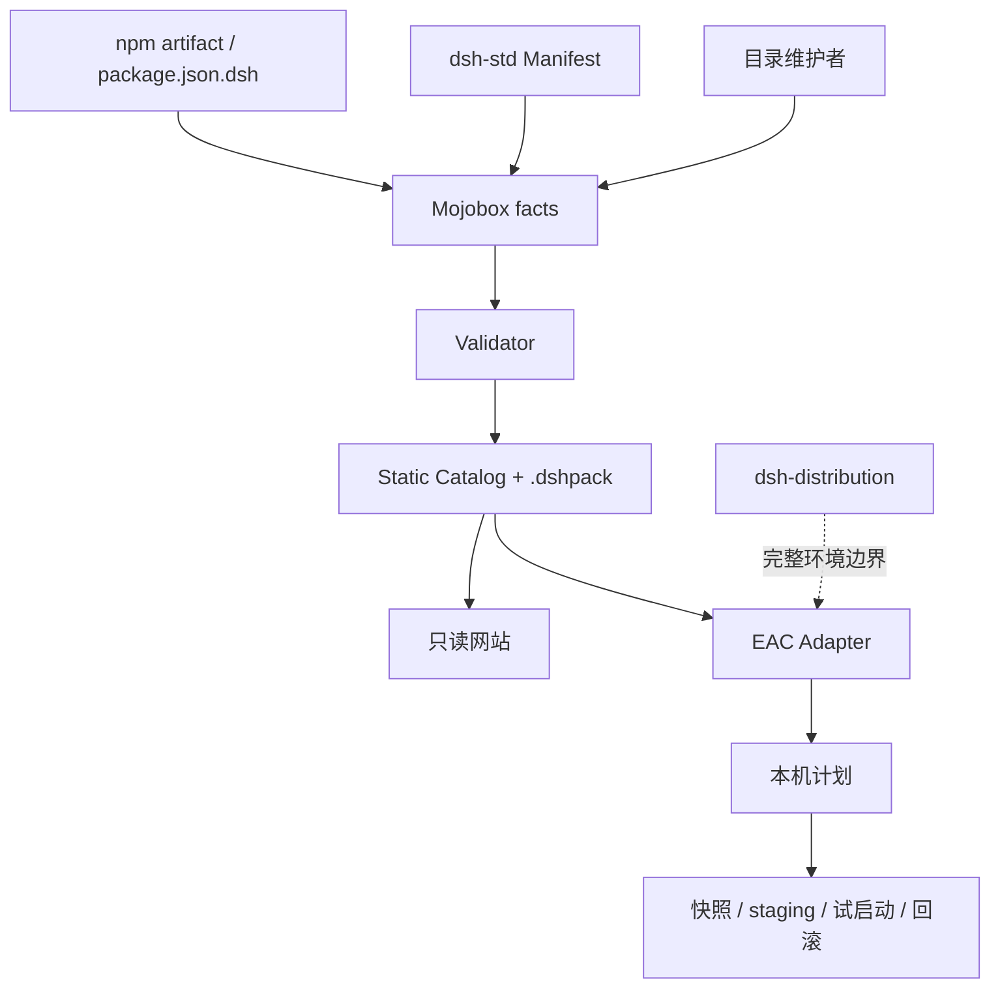
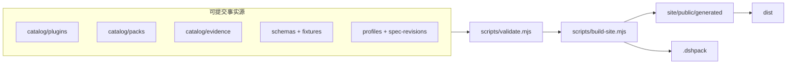
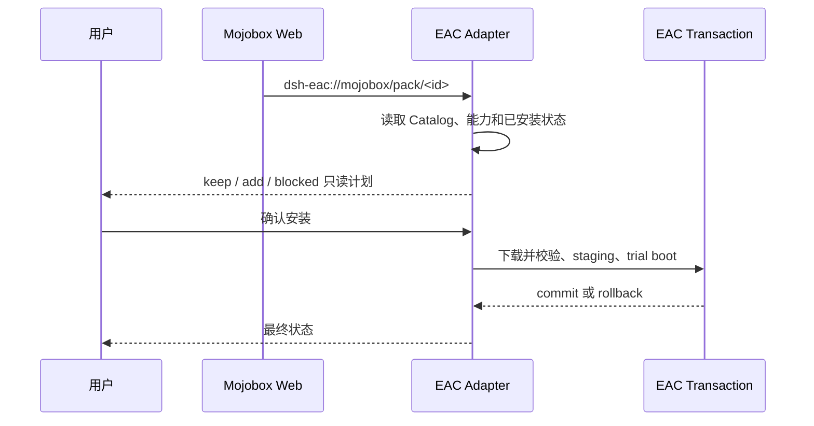

# Mojobox 架构与扩展边界

> 当前框架已采用开发者归档收录：`catalog/feature-packs/ + artifacts/ → 静态检查 → 目录/报告/原样下载 → 网站`。
> 以 [收录规范](intake.md) 和 [框架验收](framework-acceptance.md) 为准。
> 以下 Pack/Lock、组件组合及宿主联动图为历史设计，不是当前默认构建或框架完成条件。

> **当前主线**：Mojobox 收纳、检验、展示并提供功能与外观整合包的原始下载，安装与运行归下游。
> 本文的自定义 Pack/Lock 与 EAC Adapter 设计保留作 legacy 参考，不作为当前新增功能的默认方案。
> 现行方向见 [项目路线](project-positioning-and-roadmap.md)，旧计划见 [历史归档](archive/README.md)。

本文面向准备扩展 Mojobox 或 EAC Adapter 的开发者。规范字段以 `schemas/`、`fixtures/` 和固定的
上游 revision 为准。

## 1. 独立分发与宿主接入边界

Mojobox 不启动插件、不修改 profile、不持有安装锁。图中的宿主事务是职责边界，不表示已接通
当前 EAC。公共数据不能包含 EAC 的 profile 路径、RPC、snapshot ID、ownership 或 journal。

## 2. 四类协议输入

### 官方 Package Manifest

官方 Harness 在 `@deepseek-ai/dsh-package-manifest` 中声明 `package.json.dsh` 的 TypeScript 类型。
Mojobox 使用 `x-mojobox-package` 原样投影其中与目录相关的字段：`dependencies`、
`peerDependencies`、`engines` 和 `dsh`。根 `name`、`version` 继续复用插件记录字段。

投影是可选事实，不是 Mojobox 新插件协议。当前官方 loader 未必执行全部兼容约束，因此 Adapter
不能仅凭该字段宣称插件可安装。

`dsh.bundle.patch` 已按官方 `dsh-v0.1.7-alpha.1` 类型增量支持字符串或有序字符串列表，
精确来源在 `officialHarness.packageManifest.patchList`。旧字符串仍合法，不额外限制数组
长度或唯一性。其余投影未宣称全面迁移到该版本，旧 `profile.patchReload` 暂保留兼容。

### dsh-std Plugin Manifest

`dsh-std` 仍拥有插件 facet、权限、entrypoint 和运行时协商语义。当前 Catalog 基线固定在
vendored `0.15` Schema；升级时必须审阅差异、更新 vendor、fixtures 和受影响 Evidence。

### Mojobox Pack / Lock / Evidence

| 对象 | 责任 | 不负责 |
| --- | --- | --- |
| Pack | 组合意图、分类、必需/可选组件、宿主要求 | 下载解析和本机事务 |
| Pack Lock | 精确版本、source、Manifest/artifact digest | 用户 profile 与完整环境 |
| Evidence | 精确 subject、Host、suite、revision 下的结果 | 永久兼容或安全认证 |
| `.dshpack` | 离线运输 Lock 指定的字节 | 自动执行安装 |

Legacy Pack 的 `metadata.category` 可选，当前值为 `function`、`appearance`、`workflow`。新
Feature Pack 收录记录必须显式声明分类；外观记录还可携带 loader、皮肤 ID、冲突和预览来源，
这些字段只供目录和下游消费，EAC 的计划算法继续按 `components` 与 `requires` 工作。

发布策略单独放在 `distribution.json.packCategories`，当前启用 `function` 和 `appearance`。
外观包与皮肤包统一作为 `appearance` 发布，复用同一套贡献和构建系统；静态公开仍不等于
宿主安装或运行兼容已经验证。

### 完整环境协议

Profile/Preset、整套运行时、数据目录和环境迁移属于 `dsh-distribution`。未来即使网站展示完整
环境，也应通过独立对象和 Manager 接入，不把这些语义追加到 `kind: Pack`。

## 3. 事实源与生成物

`site/public/generated/`、`dist/` 和 `.cache/` 均可重建，不手工编辑、不提交。`npm test` 不访问
网络或执行插件；构建可能下载 artifact，但写入离线包前必须核对 SHA-256。

## 4. 校验与构建

Validator 依次检查：

1. Pack、Lock、Evidence 和 `dsh-std` Manifest Schema；
2. 存在 `x-mojobox-package` 时，检查官方字段投影 Schema；
3. 正例必须接受、反例必须拒绝；
4. Pack/Lock 成对、组件集合和版本一致；
5. Lock 的 source、Manifest digest 和 artifact digest 与目录一致；
6. Evidence 的 subject、suite 和 digest 与固定事实一致；
7. 历史多宿主 fixture 只绑定 `legacyTuiAdmission`，不影响通用目录。

目录不再限制插件或 Pack 数量。`components.maxItems` 等 wire contract 限制仍保留，这和开发阶段
配额是两回事。

构建器复制下载文件、读取真实 artifact、生成稳定排序与固定 ZIP 时间的 `.dshpack`，最后生成
网站消费的 `catalog.json`。Catalog 中插件会暴露 `packageMetadata`，Feature Pack 保留
`metadata.category` 和外观包的 `appearance` 声明。

正式构建先校验源数据，再按发布策略选择包及其引用的插件。归档新增实际 `archiveSize` 和
`archiveDigest`；下载失败或摘要不匹配时构建失败，不发布半成品。

`npm run lock:pack -- catalog/packs/<id>.pack.json` 根据精确组件生成 Lock，不联网、不升级
组件、不签发 Evidence。目录当前每个稳定 ID 保存一个版本，文件名与 ID 一致；发布内容改变
应增加版本。历史发行文件由版本发布保存，不原地替换。

`inspect:pack` 从 ZIP 独立读取并验证 Pack/Lock、组件元数据、对象集合和 SHA-256，不依赖
源 Catalog，不联网、不执行或解压插件。大对象流式计算摘要，JSON 单文件限制 1 MiB。
PR 与部署工作流在构建后检查每个归档，避免仅验证输入而未独立读取最终产物。

## 5. EAC Adapter 契约

Adapter 分级：Level 0 浏览 Catalog；Level 1 生成本机计划；Level 2 执行事务。上图是接入目标，
不是已完成的 EAC UI 能力。官方 CLI 实验接入位于 `adapters/official-cli.mjs`，只复用宿主
安装能力，并在明确隔离 home 中完成了合成 Bundle 安装、重复安装与禁用状态验证。
EAC Feature Pack 使用另一套 `formatVersion: 1` 格式，即使后缀
同为 `.dshpack` 也不能互换。网站已撤下未经验证的深链入口，详见 [宿主接入](host-adapter.md)。

新增 Host Adapter 时只消费公共 Catalog，不复制 EAC 私有实现。缺少安装能力时保持浏览和下载，
不暴露无效的安装按钮。

## 6. 上游与历史 Evidence

`spec-revisions.json` 将现行坐标和历史验证输入分开：

- `officialHarness`：官方 Package Manifest 类型基线；
- `dshStd`：当前 Catalog Manifest 基线；
- `dshEcosystemSpec`：现行生态入口及其挂载 revision；
- `dshTui`：当前 TUI revision，旧验证坐标放在 `legacyEvidence`；
- `legacyTuiAdmission`：已移除的旧 admission suite，仅供历史 fixture；
- `dshDistribution`：完整环境规范；
- `eacUpstream`：EAC 对齐基线。

更新现行上游不能覆盖历史坐标。只有重新运行 suite 后才能签发新 Evidence。

`evidence-suites.json` 固定历史 suite 的 ID、版本、摘要和准确 commit 源码链接，不再要求旧
Evidence 的 suite 摘要等于今天的 validator 字节。登记历史输入不代表重新执行过测试。
旧组件版本的 Evidence 可保留；构建只向当前插件关联版本、Manifest/artifact 摘要完全匹配的
记录。当前版本摘要错误仍拒绝。网站等级汇总排除失败、撤回和过期记录。

## 7. 团队扩展顺序

1. 新插件先进入 Catalog，只有真实 artifact 才能进 Lock。
2. 组合需求使用已有三种 Pack 分类，不为单个案例扩 Schema。
3. 真实宿主测试结果独立签发 Evidence，fixture 不算生产证据。
4. EAC 新能力先修改 Adapter 类型/测试，再决定是否需要公共协议字段。
5. Profile/Preset 或完整环境需求先对照 `dsh-distribution`，不要扩充 Pack。

每次协议变更至少添加一个正例和一个反例；跨 EAC 修改按 EAC 仓库影响矩阵选择测试级别。

## 8. 安全与隐私

- Catalog、日志和 `.dshpack` 不保存 token、cookie、用户路径、会话或凭据。
- 外部 artifact 在 digest 校验前不进入发布包。
- 网站只读，不获取本机文件或进程权限。
- Evidence 有明确范围、时间和撤回状态，不作为安全背书。
