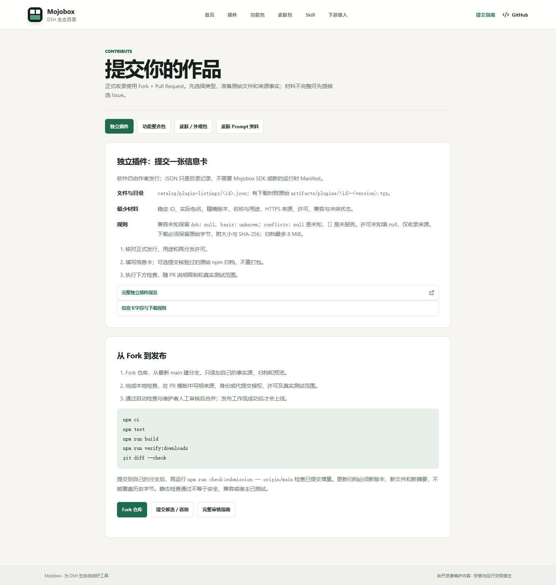
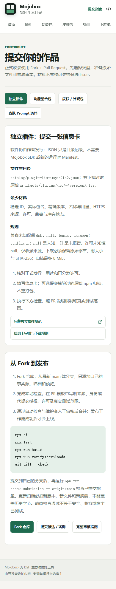
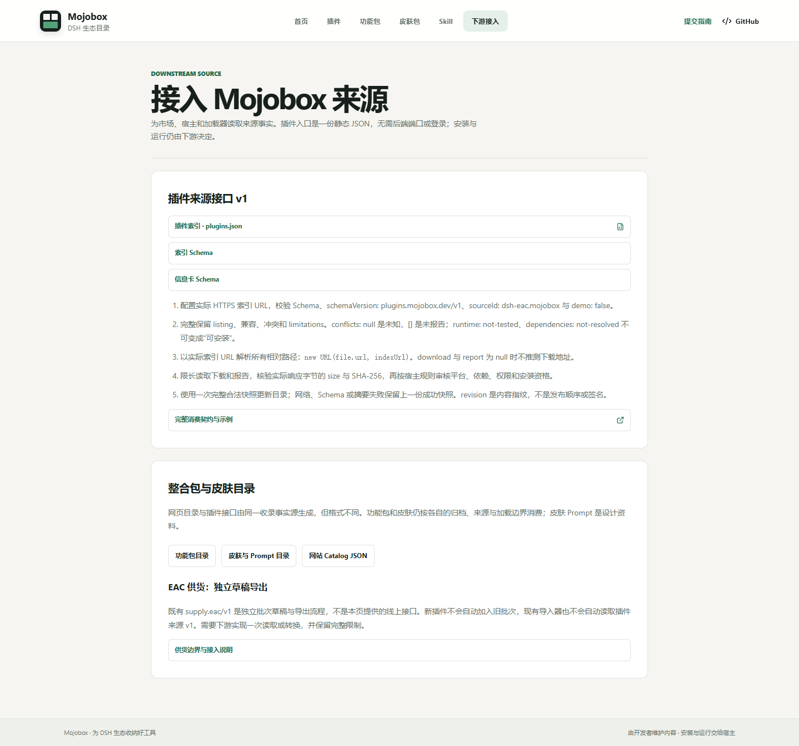

# 开发者入口与审核门禁验收

本次增加角色入口、四类提交指南和下游接口页，并恢复 PR 的 `check` 工作流。
main 保护已在 GitHub 配置，至少一位审核者批准和必需检查通过后才能合并。

## 验证范围

- 全量测试：155 项，153 通过、0 失败；Windows 符号链接条件导致 2 项跳过。
- 自制包清单和归档原始字节复核通过。
- 根路径与 `/EAC-mojobox/` 构建、下载检查通过：46 个原始下载、10 套 Prompt 资料。
- 演示构建与显式 allow-demo 检查通过。
- 1440、390、320px 浏览器验证：首页、指南总览、四类提交指南、下游页无横向溢出或页面异常。
- 类型导航及插件索引、两个 Schema、诊断 Catalog 四个链接可访问。
- 提交增量门禁、差异检查通过，原始归档、协议、历史证据与生成物未改动。

新页面须合并后 Pages 发布成功才在线可用。浏览器验证使用本地构建，未测试下游安装。
远端 CI 与审核状态以 [PR #22](https://github.com/DSH-EAC/EAC-mojobox/pull/22) 为准。

## 页面截图

### 插件投递指南：桌面

### 插件投递指南：手机

### 下游接入

