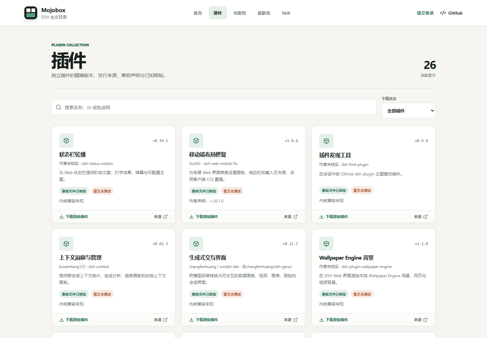
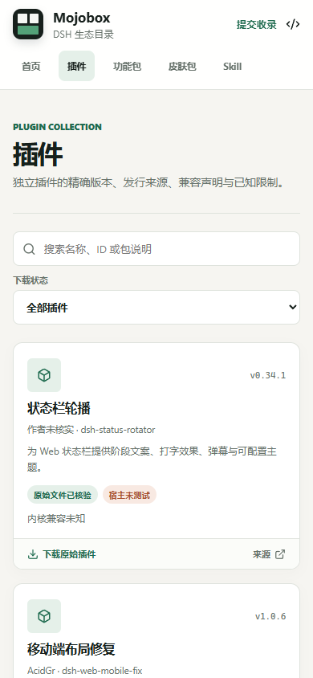

# 插件目录与来源接口验收记录

日期：2026-10-10。环境：Windows、Node.js 24.21.0、Edge 无头浏览器。
本记录覆盖 Mojobox 收录、静态构建、下载字节和页面，不是插件运行验收。

## 结果

- 26 条独立插件信息卡：24 个原始 npm 归档可下载，2 个大型候选仅展示来源。
- 22 个既有薄包与 10 套皮肤 Prompt 资料保留；原始归档未改写。
- `generated/api/v1/plugins.json` 与网站由同一事实源生成，完整保留兼容、冲突和限制。
- Skill 导航保持空分类，无独立 Skill 下载或安装。
- 历史文档移入 `docs/archive/`，旧交付说明标注历史状态与实际交付记录。

## 实际验证

| 检查 | 结果 |
| --- | --- |
| `npm ci` | 安装成功；审计告警见下文 |
| `npm test` | 153 项：151 通过，2 跳过，0 失败 |
| `node authoring/build.mjs --check` | 22 个既有薄包与事实源逐字节一致 |
| 根路径 `npm run build` / `npm run verify:downloads` | 46 个归档、10 套资料通过 |
| `BASE_PATH=/EAC-mojobox/` 同样构建与检查 | 46 个归档、10 套资料通过 |
| `npm run build:demo` / `npm run verify:downloads -- dist-demo --allow-demo` | 1 个测试归档通过，0 套生产资料 |
| `npm run check:submission -- origin/main` | 已提交增量通过，无历史归档改写与生成目录提交 |
| `git diff --check` 与改动 Markdown 相对链接检查 | 通过 |
| 本机临时 HTTP 下载核验 | 24 个下载、24 个报告的大小/SHA-256 与索引一致，两份 Schema 可读取 |
| Edge 1440、390、320 像素宽度 | 26 张卡片、2 条仅来源筛选、许可限制展示、Skill 隔离通过，无横向溢出与脚本异常 |

两项跳过分别涉及符号链接文件；当前 Windows 环境不能创建相应链接。
其他路径与链接边界测试已执行，不把跳过记为通过。

索引修订为 `sha256:cb22c2c7d916a940f3076a03ada1cc641e5c79b9ca9874eac26d1d0d6ae6dbaa`。
这是内容指纹，不是签名、发布序号或防回滚凭据。

## 页面截图

以下截图只包含 Mojobox 公开目录内容，不包含作者插件实际运行画面。

## 已知限制与后续

`npm audit` 报告 3 项高危依赖告警：`brace-expansion@5.0.9`、`fast-uri@3.1.6`、
`source-map-js@1.2.1`。它们的锁定记录与本次同步的 `origin/main` 完全相同，均为既有开发依赖；
本次新增的 `semver@7.8.5` 不在告警中。本次未顺带升级依赖，后续应以单独维护变更修复并回归构建链。

遵循 main 已停用 PR 检查工作流的决定，本次不恢复工作流或修改远端保护规则；
PR 验收依据是上述本地结果。合并后 Pages 工作流仍会重新测试、构建和校验下载。

未执行任何收录插件、安装脚本、宿主安装或皮肤加载。下游尚需一次接入新的插件索引；
旧 `supply.eac/v1` 草稿契约不变，新插件不会自动进入旧批次。
没有据本记录宣称已合并 main、公网部署、全平台兼容或运行安全。
